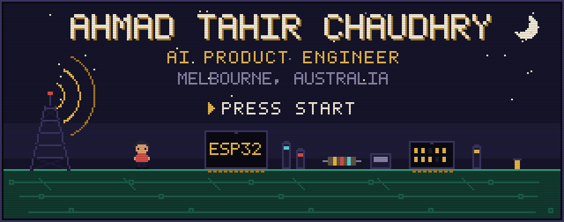
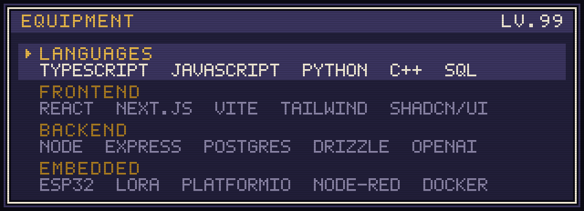
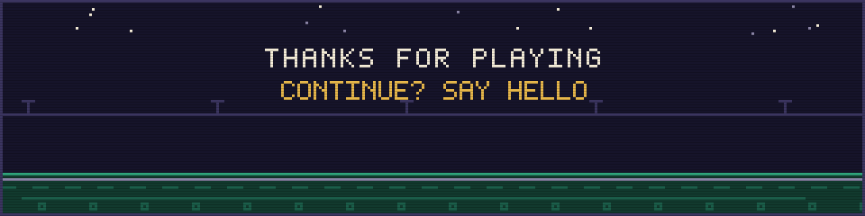

  

 

## <samp>&#9654; PLAYER</samp>

AI Product Engineer in Melbourne. I work on a multi-tenant SaaS platform where LLM features have to behave like real product surfaces rather than demos: schemas that hold up, latency you can live with, and interfaces that do not need explaining.

Before that, a Masters in Information Technology majoring in Internet of Things. That is why half of what I build has a React frontend and the other half has a radio module soldered to it.

<table>
<tr>
<td width="33%" valign="top">

<samp><b>CLASS</b></samp>

Product engineer. Agentic and LLM-backed features on React, Express and PostgreSQL.

</td>
<td width="33%" valign="top">

<samp><b>RANGE</b></samp>

Schema and API design through to frontend, containers and deployment. Firmware when the project calls for it.

</td>
<td width="33%" valign="top">

<samp><b>QUESTS</b></samp>

Open to web apps, developer tooling, and anything involving smart devices or mesh networking.

</td>
</tr>
</table>

 

## <samp>&#9654; EQUIPMENT</samp>

  

 

## <samp>&#9654; STATS</samp>

  

 

## <samp>&#9654; LEVELS</samp>

<table>
<tr>
<td width="50%" valign="top">

<samp><b>WORLD 1-1</b></samp>

### [BrickPress](https://github.com/AhmadTChaudhry/BrickPress)

Turns photos of LEGO builds into high quality, print ready posters. Upload the thing you spent a weekend on, get something worth putting on a wall.

`Next.js` `TypeScript` `Convex` `Vercel`

<a href="https://brick-press.vercel.app"><samp>play &#9654;</samp></a>

</td>
<td width="50%" valign="top">

<samp><b>WORLD 1-2</b></samp>

### [OffGrid LoRa Communication](https://github.com/AhmadTChaudhry/OffGrid-LoRa-Communication)

Secure messaging between ESP32 nodes over LoRa radio, with no infrastructure in between. Each node hosts its own WiFi access point and web chat UI, tracks message acknowledgements, and reports status on an OLED.

`C++` `ESP32` `SX1262` `RadioLib` `WebSockets`

</td>
</tr>
<tr>
<td width="50%" valign="top">

<samp><b>WORLD 2-1</b></samp>

### [Dotted](https://github.com/AhmadTChaudhry/Dotted-Habit-Tracker)

A deliberately minimal habit tracker. Log occurrences, read a month at a glance as coloured dots, define your own categories. No account, no sync, no nagging.

`React` `TypeScript` `Vite` `Tailwind` `shadcn/ui`

</td>
<td width="50%" valign="top">

<samp><b>WORLD 2-2</b></samp>

### [IoT Home Automation](https://github.com/AhmadTChaudhry/IoT-Home-Automation)

End to end home automation covering both gas and electrical appliances, with a web dashboard for monitoring and control.

`Node.js` `EJS` `IoT` `Embedded`

</td>
</tr>
<tr>
<td width="50%" valign="top">

<samp><b>WORLD 3-1</b></samp>

### [Smart Commute](https://github.com/AhmadTChaudhry/smart-commute-kubernetes)

A commute data pipeline split into services: an API tier, a processing tier and Node-RED, containerised and orchestrated with Kubernetes manifests.

`JavaScript` `Docker` `Kubernetes` `Node-RED`

</td>
<td width="50%" valign="top">

<samp><b>BONUS STAGE</b></samp>

### [Everything else](https://github.com/AhmadTChaudhry?tab=repositories)

Thirty or so repositories of IoT coursework, web experiments and small tools built to scratch an itch. Worth a dig.

</td>
</tr>
</table>

 

## <samp>&#9654; CONTINUE?</samp>

&nbsp;

&nbsp;

&nbsp;

  

