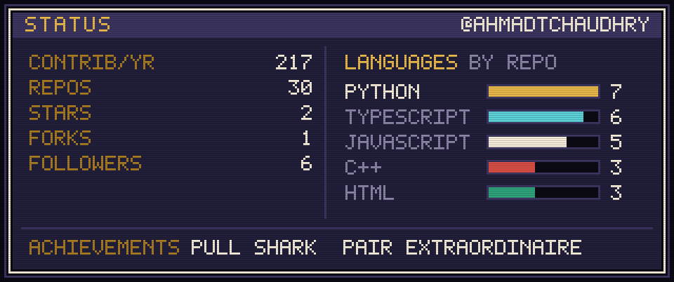

  

 

## <samp>&#9654; PLAYER</samp>

AI Product Engineer in Melbourne. I work on a multi-tenant SaaS platform where LLM features have to behave like real product surfaces rather than demos. Building conversational and other agentic workflows to automate tasks and make tedious work more efficient.

Before that, a Masters in Information Technology majoring in Internet of Things. That is why half of what I build has a React frontend and the other half has a radio module soldered to it.

<table>
<tr>
<td width="33%" valign="top">

<samp><b>CLASS</b></samp>

Product engineer. Agentic and LLM-backed features on React, Express and PostgreSQL.

</td>
<td width="33%" valign="top">

<samp><b>RANGE</b></samp>

Schema and API design through to frontend, containers and deployment. Firmware when the project calls for it.

</td>
<td width="33%" valign="top">

<samp><b>QUESTS</b></samp>

Open to web apps, developer tooling, and anything involving smart/embedded devices or networking.

</td>
</tr>
</table>

 

## <samp>&#9654; EQUIPMENT</samp>

  

 

## <samp>&#9654; STATS</samp>

  

 

## <samp>&#9654; LEVELS</samp>

<table>
<tr>
<td width="50%" valign="top">

<samp><b>WORLD 1-1</b></samp>

### [RationAI](https://github.com/AhmadTChaudhry/RationAI)

A desk display that shows your Claude and ChatGPT quota in real time. Firmware on a LilyGO T-Display-S3 talks to a small Mac server over WiFi, and the mascot waves at you when Claude is sitting there blocked, waiting for a reply.

`C++` `ESP32-S3` `PlatformIO` `Python` `Bonjour`

</td>
<td width="50%" valign="top">

<samp><b>WORLD 1-2</b></samp>

### [OffGrid LoRa Communication](https://github.com/AhmadTChaudhry/OffGrid-LoRa-Communication)

Secure messaging between ESP32 nodes over LoRa radio, with no infrastructure in between. Each node hosts its own WiFi access point and web chat UI, tracks message acknowledgements, and reports status on an OLED.

`C++` `ESP32` `SX1262` `RadioLib` `WebSockets`

</td>
</tr>
<tr>
<td width="50%" valign="top">

<samp><b>WORLD 2-1</b></samp>

### [Tapestry](https://github.com/AhmadTChaudhry/Tapestry)

Turns a photograph into a tapestry crochet stitch chart you can follow row by row while your hands are busy, and previews how it will look in a different yarn colourway before you buy the wool.

`Prototype` `Canvas` `Mobile first`

<a href="https://stitches-tapestry.vercel.app"><samp>play &#9654;</samp></a>

</td>
<td width="50%" valign="top">

<samp><b>WORLD 2-2</b></samp>

### [Minutely](https://github.com/AhmadTChaudhry/Minutely-Meeting-Debrief)

Paste in a meeting transcript, get back an executive summary, action items with owners and deadlines, and the risks nobody wrote down. Read it as a table or work it as a kanban board.

`Next.js` `n8n` `Gemini`

<a href="https://minutely-six.vercel.app"><samp>play &#9654;</samp></a>

</td>
</tr>
<tr>
<td width="50%" valign="top">

<samp><b>WORLD 3-1</b></samp>

### [Vantage](https://github.com/AhmadTChaudhry/Vantage-Agent-Architect)

Turns a strategy document into an execution ready agent workforce blueprint: initiatives, agent roles, and how they all relate. Upload a PDF or paste the text, read the architecture back as a map, export it as JSON.

`Next.js 14` `TypeScript` `n8n` `pdf2json`

<a href="https://vantage-agent-psi.vercel.app"><samp>play &#9654;</samp></a>

</td>
<td width="50%" valign="top">

<samp><b>WORLD 3-2</b></samp>

### [Aurora](https://github.com/AhmadTChaudhry/Aurora)

A redesign of WLED, the addressable LED firmware for ESP32. Single strips through to HUB75 matrices, with audio reactive effects, per segment control, and Home Assistant, Art-Net and E1.31 out of the box.

`C++` `ESP32` `WLED` `Art-Net` `E1.31`

</td>
</tr>
</table>

 

## <samp>&#9654; CONTINUE?</samp>

&nbsp;

&nbsp;

&nbsp;

  

